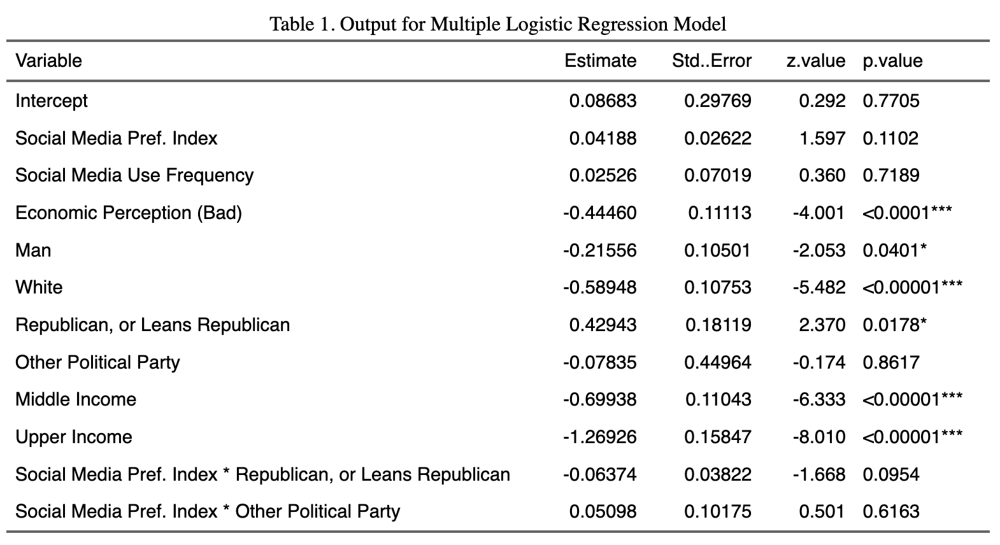

<center>

## Factors Affecting Support for Autocratic Governance Among U.S. Adults\center

#### Sam Minard^1^ & Efrain Ramirez^2^

^*1*^*Department of Social Sciences & Global Studies, California State University, Monterey Bay, Seaside, CA*

^*2*^*Department of Psychology, California State University, Monterey Bay, Seaside, CA*

```{r}
#| label: setup
#| include: FALSE
library(haven)
library(readxl) 
library(tidyverse)
library(ggplot2)
library(forcats)
library(sjmisc)
library(ggridges)
library(flextable)

amertrends_clean <- read_csv("data/data-clean/amertrends_clean.csv")
```

::: {style="text-align: left;"}
## Introduction

As of 2021, 70% of the world’s population, or 5.4 billion people, live under an autocratic regime (Boese et al., 2022). Autocracies are a form of government “by a single person or small group that has unlimited power or authority” (Cambridge University Press & Assessment, n.d.), and they often arise from populist movements. Populism is an exclusionary, anti-elitist, anti-pluralist political ideology based on the idea that the “true people” are under threat from some kind of elite enemy, be it an economic, political, racial, or foreign one (Berlin et al., 1968). The ideology can fuel support for autocratic leaders who persuade the public that only they can protect them from perceived enemies, thus justifying the consolidation of executive power without accountability (Al Waroi et al., 2024; Baturo et al., 2024). Donald Trump’s populist messaging has galvanized many Americans against a variety of perceived enemies, including racial and gender minorities, immigrants, and other vaguely defined “elites.” Since regaining the presidency in 2025, Trump has taken steps to consolidate his power and remove checks and balances, thus bringing the United States closer to an authoritarian autocracy– and many Americans wholeheartedly support this transformation. Therefore, this paper seeks to understand the factors associated with support for autocratic leadership among Americans.

Populist movements and the autocratic leaders they support are often fueled by anxiety and subjective perceptions of economic insecurity, irrespective of whether objective measures of hardship are present (Gidron & Hall, 2017). In other words, actual economic insecurity is not necessary, only the perception of insecurity. Moreover, it is the perception of economic insecurity at the macro level that significantly predicts these attitudes, not at the micro level (Watson et al., 2021). Severe real-world threats can be especially impactful in this regard. For example, through their analysis of the Covid-19 pandemic and the subsequent economic downturn in Italy, Rocatto et al. (2020) found that times of uncertainty and hardship can drive people toward anti-democratic, authoritarian, and autocratic leaders because they offer a restored sense of control over their social world. Given that a recent Pew Research Center poll found Americans’ current economic ratings to be predominantly negative (Cerda, 2025), it is important to test the relationship between subjective economic insecurity and anti-democratic sentiment in the US. Therefore, our first research question is as follows: *How does perceived macro level economic insecurity relate to support for autocratic leadership?*

As the information channels American society relies on continue to evolve, it is important to consider the relationship between media type preferences and anti-democratic sentiments that encourage support for autocratic leadership. Notably, mainstream media trust among conservatives has declined, leading them to seek alternatives like social media, where they may encounter misinformation and populist rhetoric (Hutchens et al., 2025; Mourão, 2017). While social media has been touted as a democratic panacea because of its potential for disseminating anti-regime information and mobilizing collective action, many autocratic regimes engage in social media censorship (Gunitsky, 2015). However, Gunitsky (2015) argues that many regimes have since moved from suppression to co-optation of social media as a tool to maintain autocratic stability– a far more insidious tactic. Co-opting social media allows autocratic regimes to shape the discourse on social media, promote counter-mobilization, and bolster regime legitimacy. Given autocratic co-optation alongside the transition to social media as the public’s primary source of news and information, it is crucial to investigate the relationship between social media use and support for autocratic governance among American adults. Furthermore, the disparity in media preferences between conservatives and liberals means that political ideology must be considered as a mediating factor in this relationship. As a result, we propose the following research question: *Is a preference for getting news and information primarily from social media associated with support for autocratic leadership? How does this relationship vary depending on political ideology?*

By investigating these research questions, this paper will contribute to our understanding of the factors associated with support for autocratic leadership among Americans. First, we hypothesize that higher perceived macro level economic insecurity is associated with support for autocratic leadership. Second, we hypothesize that there is a stronger relationship between the preference for getting news and information primarily from social media and support for autocratic leadership among conservatives compared to liberals.

## Methods

### Data Collection
This study conducts secondary analysis of the American Trends Panel Wave 124 data set from Pew Research Center, also known as ATP Wave 124. The survey was administered to a nationally representative, stratified random sample of U.S. adults from March 20 to March 26, 2023. Of the 4,058 panelists sampled, 3,576 responded, resulting in a response rate of 88%. Hispanic men, non-Hispanic Black men, and non-Hispanic Asian were oversampled then weighted to provide more precise estimates. 

### Variable Creation

The primary dependent variable in this study is support for autocratic leadership, which was measured through the following question: “Would each of the following political systems be a good or bad way of governing this country? A system in which a strong leader can make decisions without interference from Congress or the courts.” Response options included a range from “Very good” to “Very bad,” and “Refused.” This was re-coded into “Supports” and “Does not support" to ensure a binary response variable. 

Independent variables we considered included demographics such as age, race, gender, and family income. In addition, we used economic perception (“How would you describe the current economic situation in the U.S.?”) to measure perceived economic insecurity at the macro level. Categories were collapsed into “Good” and “Bad.” Finally, multiple variables measured respondents’ news source and social media preferences, including how often respondents get news, facts, and opinions about issues or events from social media sites, and whether respondents prefer getting various kinds of information from news outlets, social media, both, or neither. The five variables concerning whether respondents preferred news outlets or social media were re-coded to contain three levels (2: “Prefers social media”;  1: “Prefers both”; and 0: “Prefers news outlets or neither”). Then, the values for each were summed within each row to assign an index score for social media preference to each respondent. With a range of 0-10, higher scores indicated a stronger preference for obtaining information from social media. For all variables, “Refused” responses were treated as “NA” and dropped. The final sample size included in the model was 2065 observations.

### Analytical Methods

Frequency tables were used to summarize the counts and proportions for control variables including income, race, gender, and political party categories. They were also used to summarize the response and some explanatory variables. The social media preference index score distribution for each autocratic support category was illustrated with ridgelines and boxplots. Multiple logistic regression was used to predict support for autocratic leadership. We included the aforementioned theory-driven variables as well as income, race ("White" or "Non-White"), gender, and political leaning in the final model. Control variables were refined through stepwise selection, which removed only age. 

## Results

### Exploratory Data Analysis

Figure 1 shows that social media preference index score distributions are similar between those who do and do not support autocratic leadership. However, the supportive group's mean score (3.672) was marginally higher than the non-supportive group's (3.510). 

```{r}
#| label: figure-1
#| echo: false 
#| fig-width: 6
#| fig-height: 4

#boxplot + ridgelines for sm_pref_index by autoc_support categories
amertrends_clean |> 
  ggplot(aes(x = sm_pref_index, 
             y = autoc_support_cat, 
             fill = autoc_support_cat)) +
   geom_density_ridges(scale = 0.55, 
                       alpha = 0.5) +
  geom_boxplot(aes(fill = autoc_support_cat),
               width = 0.25,
               alpha = 0.75) +
  theme_bw() +
  scale_fill_manual(values = c("turquoise4", "orange2")) +
  labs(x = "Social Media Preference Index Score",
       y = "Autocratic Leadership Support",
       title = "Figure 1. Distribution of Social Media Preference Index \nAcross Autocratic Leadership Support Categories") +
  guides(fill = "none") +
  xlim(0,10)

#summary stats for each category 
amertrends_clean |> 
  group_by(autoc_support_cat) |> 
  summarize(`mean sm_pref_index` = mean(sm_pref_index),
            sd = sd(sm_pref_index))
```

Figure 2 displays the proportions of respondents who support autocratic leadership within each economic perception category, faceted by political leaning. Across all political groups, a higher proportion of those who perceive the economy as "good" express support for autocracy. Frequency tables for income, political party, race, gender, and economic perception are included in the appendix.
```{r}
#| label: figure-2
#| echo: false
#| fig-width: 6
#| fig-height: 4
amertrends_clean |> 
  ggplot() +
  geom_bar(aes(x = econ_percep,
               fill = autoc_support_cat),
           position = "fill",
           alpha = 0.8) +
  facet_wrap(~pol_lean, ncol = 3) +
  theme_bw() +
  theme(legend.position = "bottom") +
  scale_fill_manual(values = c("turquoise4", "orange2")) +
  labs(x = "Economic Perception",
       y = "Proportion of Respondents",
       fill = "Autocratic Leadership",
       title = "Figure 2. Support for Autocratic Leadership \nby Economic Perception and Political Leaning")
```

### Statistical Analysis

Table 1 below summarizes the multiple logistic regression model output for autocratic leadership support. The estimates and p-values will be interpreted in the following section. 
Log odds model: $ln(p(x)/1-p(x))=-0.57324+0.04294x_{1}+0.02412x_{2}+0.44557x_{3}-0.02921x_{4}+0.22214x_{5}-0.58883x_{6}-0.06985x_{7}+0.42960x_{8}-0.69719x_{9}+-1.26958x_{10}+0.04836x_{7}x_{1}-0.08469x_{11}x_{1}$


## Conclusion

The purpose of this study is to determine whether individuals' social media reliance and perception of the economy as generally good or bad might predict support for autocratic leadership in the United States. In addition, an interaction between social media reliance and political ideology is also considered. There is very strong evidence that at least one variable in the model with social media preference index score, social media use frequency, economic perception, gender, race, political leaning, income, and the social media preference-political leaning interaction has predictive power of autocratic support (G = 141.3424, p-value < 0.001). However, the model overall is a poor fit, as evidenced by the AUC value (AUC = 0.6589). 

Several predictors were statistically significant, including the intercept (z = -1.978, p-value = 0.0479), perceiving the econoomy as good (z = 4.009, p-value < 0.0001), being a woman (z = 2.100, p-value = 0.0357), being white (z = -5.475, p-value < 0.00001), being or leaning Republican (z = 2.371, p-value = 0.0177), being middle income (z = -6.309, p-value < 0.00001), and being upper income (z = -8.011, p-value < 0.00001). Social media preference index score, social media use frequency, being non-binary, being neither Republican nor Democrat, and the interaction between social media preference index score and political leaning were not statistically significant.

## References

## Appendix

```{r}
#| label: load-and-clean-data

#read the data file
amertrends <- read_sav("data/data-raw/W124_Mar23/ATP W124.sav")

#load the codebook for the data to understand what each variable represents
#amertrends_codebook <- read_excel("data/data-raw/W124_Mar23/ATP W124 Codebook.xlsx")

#selecting a subset the variables for exploration 
amertrends_subset <- amertrends |> 
  select(POLSYS_AUTOC_W124, ECON_SIT_W124, NEWSSOURCE_e_W124, NEWSUSE_PLAT_a_W124, NEWSUSE_PLAT_b_W124, NEWSUSE_PLAT_c_W124, NEWSUSE_PLAT_d_W124, NEWSUSE_PLAT_e_W124, F_AGECAT, F_GENDER, F_EDUCCAT, F_RACECMB, F_PARTYSUM_FINAL, F_INC_TIER2)

#change variable names to snake_case
amertrends_subset <- janitor::clean_names(amertrends_subset) 

#converting 99 to NA (99 means "refused"/didn't answer that question so it must be treated as NA)
amertrends_subset <- amertrends_subset |> 
  mutate(across(everything(), ~ replace(.x, .x == 99, NA)))

#redefine column types to factor since they represent ordered categories/likert scale 
amertrends_subset <- amertrends_subset |> 
  mutate(across(where(is.numeric), as.factor))
```

In the code chunk below, we create two versions of the binary response variable (autoc_support): one with values 0 and 1 for the model, and one with descriptive labels for visualizations.
```{r}
#| label: clean-response

#make the response autoc variable binary/logical so it will work in the logistic model
#change column type to numeric
amertrends_subset <- amertrends_subset |> 
  mutate(autoc_support = fct_collapse(polsys_autoc_w124,
                                    `1` = c("1", "2"),
                                    `0` = c("3", "4"))) |> 
  drop_na(autoc_support)

#make another version with descriptive labels for frequency table
amertrends_subset <- amertrends_subset |> 
  mutate(autoc_support_cat = fct_collapse(polsys_autoc_w124,
                                    `Supports` = c("1", "2"),
                                    `Does not support` = c("3", "4")))  |> 
  drop_na(autoc_support_cat)
```

In the code chunk below, we recode the explanatory variables and create a new, clean data csv. 
```{r}
#| label: clean-explanatory

#defining the levels of key explanatory variables

#step 1: economic perception
amertrends_subset <- amertrends_subset|> 
  drop_na(econ_sit_w124) |> 
  mutate(econ_sit_w124 = fct_recode(econ_sit_w124,
                          "very good" = "1",
                          "somewhat good" = "2",
                          "somewhat bad" = "3",
                          "very bad" = "4")) 

#since there are considerably fewer observations at the extremes, collapse econ_sit_w124 into 2 categories: good and bad
amertrends_subset <- amertrends_subset |> 
  mutate(econ_percep = fct_collapse(econ_sit_w124,
                                      good = c("very good", "somewhat good"),
                                      bad = c("very bad", "somewhat bad")))

#step 2: creating social media reliance index variable

#re-coding newsuse variables
#newsuse_plat_a basic facts
amertrends_subset <- amertrends_subset |> 
  drop_na(newsuse_plat_a_w124) |> 
  mutate(sm_pref_basicfacts = fct_collapse(newsuse_plat_a_w124,
                                      `2` = c("2"),
                                      `1` = c("3"),
                                      `0` = c("1", "4"))) 
#newsuse_plat_b opinions
amertrends_subset <- amertrends_subset |> 
  drop_na(newsuse_plat_b_w124) |> 
  mutate(sm_pref_opinions = fct_collapse(newsuse_plat_b_w124,
                                      `2` = c("2"),
                                      `1` = c("3"),
                                      `0` = c("1", "4"))) 
#newsuse_plat_c in depth info
amertrends_subset <- amertrends_subset |> 
  drop_na(newsuse_plat_c_w124) |> 
  mutate(sm_pref_indepth = fct_collapse(newsuse_plat_c_w124,
                                      `2` = c("2"),
                                      `1` = c("3"),
                                      `0` = c("1", "4"))) 
#news_plat_d up to date info
amertrends_subset <- amertrends_subset |> 
  drop_na(newsuse_plat_d_w124) |> 
  mutate(sm_pref_uptodate = fct_collapse(newsuse_plat_d_w124,
                                      `2` = c("2"),
                                      `1` = c("3"),
                                      `0` = c("1", "4"))) 
#news_plat_e info that impacts the respondent
amertrends_subset <- amertrends_subset |> 
  drop_na(newsuse_plat_e_w124) |> 
  mutate(sm_pref_impactsr = fct_collapse(newsuse_plat_e_w124,
                                      `2` = c("2"),
                                      `1` = c("3"),
                                      `0` = c("1", "4"))) 

#create the index variable for social media preference
amertrends_subset <- amertrends_subset |> 
  drop_na(sm_pref_basicfacts, sm_pref_opinions, sm_pref_indepth, sm_pref_uptodate, sm_pref_impactsr) |> 
  rowwise() |> 
  mutate(sm_pref_index = sum(as.numeric(as.character(c_across(starts_with("sm_pref_")))))) |>
  ungroup() 

#step 3: social media use frequency

#re-level newssource_plat_e: how frequently they get their news from social media
#make numeric for regression purposes (treat as a score: higher = more frequently)
amertrends_subset <- amertrends_subset |> 
  mutate(sm_freq = fct_recode(newssource_e_w124, 
                              "5" = "1",
                              "4" = "2",
                              "3" = "3",
                              "2" = "4",
                              "1" = "5")) 
#another version with descriptive labels for freq table
amertrends_subset <- amertrends_subset |> 
  mutate(sm_freq_cat = fct_recode(newssource_e_w124, 
                                  "Extremely often" = "5",
                                  "Fairly often" = "4",
                                  "Sometimes" = "3",
                                  "Rarely" = "2",
                                  "Never" = "1")) 

#step 4: demographics 
#re-code age to more descriptive values
amertrends_subset <- amertrends_subset |> 
  mutate(age = fct_recode(f_agecat,
                          "18-29" = "1",
                          "30-49" = "2",
                          "50-64" = "3",
                          "65+" = "4")) 

#recode race to binary, set reference level to non-white
amertrends_subset <- amertrends_subset |> 
  mutate(race_1 = fct_collapse(f_racecmb,
                          "Non-White" =  c("2", "3", "4", "5"),
                          "White" = "1")) |> 
  mutate(race_1 = fct_relevel(race_1,
                             "White", after = 1)) 

#recode party lean, set reference level to democrat
amertrends_subset <- amertrends_subset |> 
  mutate(pol_lean = fct_recode(f_partysum_final,
                          "Republican, or leans Republican" = "1",
                          "Democrat, or leans Democrat" = "2",
                          "Other" = "9"),
         pol_lean = fct_relevel(pol_lean, 
                                "Republican, or leans Republican", after = 1))

#recode income
amertrends_subset <- amertrends_subset |> 
  mutate(income = fct_recode(f_inc_tier2,
                          "Lower income" = "1",
                          "Middle income" = "2",
                          "Upper income" = "3"))

#drop NAs to ensure later codes work (especially ROC curve codes)
amertrends_subset <- amertrends_subset |> 
  drop_na(autoc_support, sm_pref_index, sm_freq, econ_percep, age, race_1, pol_lean, income)

#recode gender
amertrends_subset <- amertrends_subset |> 
  mutate(gender = fct_recode(f_gender,
                             "Man" = "1",
                             "Woman" = "2",
                             "Other" = "3"))


write_csv(amertrends_subset, "data/data-clean/amertrends_clean.csv")

```


In the code chunk below, we create the first model with all demographic and theory-driven variables under consideration. We then check the ROC curve.
```{r}
#| label: model-v1
#| eval: false

#creating the first model using all theory-driven variables AND all demographic/control variables
autoc_lm_v1 <- glm(autoc_support ~ sm_pref_index + sm_freq + factor(econ_percep) + factor(age) + factor(gender) + factor(race_1) + factor(pol_lean)  + factor(pol_lean)*sm_pref_index + factor(income), family = binomial(link = "logit"), data = amertrends_clean)
summary(autoc_lm_v1)

#ROC curve for v1
#predicted probabilities
predicted_probs_v1 <- predict(autoc_lm_v1, type = "response")
#actual outcomes
actual_outcomes_v1 <- autoc_lm_v1$y
#ROC plot and AUC
roc_v1 <- roc(actual_outcomes_v1, predicted_probs_v1)
plot(roc_v1, legacy.axes = TRUE, main = "ROC Curve for autoc_lm_v1", 
     col = "blue", xlab = "False Positive Rate (1 - Specificity)", 
     ylab = "True Positive Rate (Sensitivity)")
auc(roc_v1)

#not a great model, so we will try adjusting which demographic variables are included to see if that improves things
```

In the code chunk below, we use stepwise selection to find the "best" model. Because the variable selection is partly theory-driven, we make the smaller model include the theory-driven variables to ensure they are included in the final model, rather than setting the lower model to a null model. The process results in a model that includes every predictor except age.  We then check the ROC curve and find that it is not much better or worse than the previous model. Given the stepwise results and the fact that all age categories were insignificant per the Wald-z tests, we decide to proceed with the model without age. There appears to be collinearity between the interaction term sm_pref_index*pol_lean and pol_lean. 
```{r}
#| label: model-v2
#| eval: false
#stepwise selection to determine best demographic variables for the model
#fit the lower and upper models
#lower includes the theory-driven variables that must be included in the model regardless of their effect on AIC
small_v1<- glm(autoc_support ~ sm_pref_index + sm_freq + factor(econ_percep) + factor(pol_lean) + factor(pol_lean)*sm_pref_index , family = binomial(link = "logit"), data = amertrends_clean)
#big has optional demographic variables
big_v1<- glm(autoc_support ~ sm_pref_index + sm_freq + factor(econ_percep) + factor(age) + factor(gender) + factor(race_1) + factor(pol_lean) + factor(pol_lean)*sm_pref_index + factor(income), family = binomial(link = "logit"), data = amertrends_clean)
#stepwise selection based on AIC
autoc_lm_v2 <- step(big_v1, scope = list(lower = small_v1, upper = big_v1), direction = "both")
#final selected model (based on AIC) includes race, political leaning, and income as controls (age was removed)

#model parameter estimates and significance testing
summary(autoc_lm_v2)

#ROC curve for v2
#predicted probabilities
predicted_probs_v2 <- predict(autoc_lm_v2, type = "response")
#actual outcomes
actual_outcomes_v2 <- autoc_lm_v2$y
#ROC
roc_v2 <- roc(actual_outcomes_v2, predicted_probs_v2)
#plot the curve
plot(roc_v2, legacy.axes = TRUE, main = "ROC Curve for autoc_lm_v2", 
     col = "blue", xlab = "False Positive Rate (1 - Specificity)", 
     ylab = "True Positive Rate (Sensitivity)")
auc(roc_v2)
#AUC gets slighter smaller but the difference is negligible
#decided to proceed with model v2 (sans age) because it isn't a significant predictor anyway and does not add much value to the model

#assumptions: check for collinearity
#some collinearity between the interaction sm_pref_index*pol_lean and pol_lean, but the rest are fine
car::vif(autoc_lm_v2)

#check significance overall
G <- autoc_lm_v2$null.deviance - autoc_lm_v2$deviance
G
df <- autoc_lm_v2$df.null - autoc_lm_v2$df.residual
1 - pchisq(G, df)
```

In the code chunk below, we create the summary table for the final mode. It doesn't appear in the rendered word document unfortunately, so we include a screenshot in the text instead.
```{r}
#| label: model-summary-table
#| echo: false
#| eval: false

coef <- c(
  "-0.57324", "0.04294", "0.02412", "0.44557", "-0.02921", "0.22214", "-0.58883", "-0.06985", "0.42960", "-0.69719", "-1.26958", "0.04836", "-0.08469") 

std.error <- c(
  "0.28981", "0.02629", "0.07023", "0.11115", "0.49880", "0.10576", "0.10755", "0.45001", "0.18116", "0.11051", "0.15848", "0.10190", "0.03826")

z.value <- c(
  "-1.978", "1.633", "0.343", "4.009", "-0.059", "2.100", "-5.475", "-0.155", "2.371", "-6.309", "-8.011", "0.475", "-1.691")

p.value <- c(
  "0.0479*", "0.1024", "0.7312", "<0.0001***", "0.9533", "0.0357*", "<0.00001***", "0.8766", "0.0177*", "<0.00001***", "<0.00001***", "0.6351", "0.0909")

summary_v2 <- data.frame(
  Estimate = coef,
  `Std. Error` = std.error,
  `z-value` = z.value,
  `p-value` = p.value)

rownames(summary_v2) <- c(
  "Intercept", "Social Media Pref. Index", "Social Media Use Frequency",
  "Economic Perception (Good)", "Other Gender", "Woman", "White",
  "Other Party", "Republican, or Leans Republican", "Middle Income",
  "Upper Income", "Social Media Pref. Index * Other Party",
  "Social Media Pref. Index * Republican, or Leans Republican")

# Add row names as a column
summary_v2$Variable <- rownames(summary_v2)

# Reorder to put 'Variable' first
summary_v2 <- summary_v2[, c("Variable", setdiff(colnames(summary_v2), "Variable"))]

# Make the flextable
flextable(summary_v2) |> 
  set_caption("Table 1. Output for Multiple Logistic Regression Model") |> 
  set_header_labels(
    Variable = "Variable",
    Estimate = "Estimate",
    `Std. Error` = "Std. Error",
    `z-value` = "z-value",
    `p-value` = "p-value") |> 
  autofit()
```

Table 2. Frequency table for gender categories.
```{r}
#| echo: FALSE
frq(amertrends_clean$gender, out = "txt")
```

Table 3. Frequency table for income categories.

```{r}
#| echo: FALSE
frq(amertrends_clean$income, out = "txt")
```

Table 4. Frequency table for race categories.

```{r}
#| echo: FALSE
frq(amertrends_clean$race_1, out = "txt")
```

Table 5. Frequency table for economic perception categories.

```{r}
#| echo: FALSE
frq(amertrends_clean$econ_percep, out = "txt")
```

Table 6. Frequency table for political leaning categories.

```{r}
#| echo: FALSE
frq(amertrends_clean$pol_lean, out = "txt")
```

## References

Al Waroi, M. N. A. L., Riyanta, S., & Rustam, M. R. (2024). Populism and the erosion of democratic checks and balances: A systematic literature review across regions. International Journal of Multidisciplinary Research and Analysis, 7(10), 4728-4738. <https://doi.org/10.47191/ijmra/v7-i10-18>

Baturo, A., Kenny, P. D., & Balta, E. (2024). Leaders’ experience and the transition from populism to dictatorship. Democratization, 1–24. <https://doi.org/10.1080/13510347.2024.2391482>

Berlin, I., Hofstadter, R., MacRae, D., Schapiro, L., Seton-Watson, H., Touraine, A., Venturi, F., Walicki, A., & Worsley, P. (1968). To define populism. Government and Opposition, 3(2), 137–179. <http://www.jstor.org/stable/44481863>

Boese, V. A., Lundstedt, M., Morrison, K., Sato, Y., & Lindberg, S. I. (2022). State of the world 2021: Autocratization changing its nature? Democratization, 29(6), 983–1013. <https://doi.org/10.1080/13510347.2022.2069751>

Cambridge University Press & Assessment. (n.d.). Autocracy. In Cambridge dictionary. Retrieved March 16, 2025, from <https://dictionary.cambridge.org/us/dictionary/english/autocracy>

Cerda, A. (2025, February 11). Republicans think economy will improve over the next year, Democrats expect it to get worse. Pew Research Center. <https://www.pewresearch.org/short-reads/2025/02/11/republicans-think-economy-will-improve-over-the-next-year-democrats-expect-it-to-get-worse/>

Gidron, N., & Hall, P. A. (2017). The politics of social status: Economic and cultural roots of the populist right. The British Journal of Sociology, 68(S1). <https://doi.org/10.1111/1468-4446.12319>

Hutchens, M. J., Shaughnessy, B., & DuBosar, E. (2025). Populist hyperpartisans?: The interaction between partisan media exposure and populism in the 2020 US presidential election. Mass Communication and Society, 28(1), 51–75. <https://doi.org/10.1080/15205436.2023.2264265>

Mourão, R. R., Thorson, E., Chen, W., & Tham, S. M. (2018). Media repertoires and news trust during the early Trump administration. Journalism Studies, 19(13), 1945–1956. <https://doi.org/10.1080/1461670X.2018.1500492>

Mutz, D. C. (2018). Status threat, not economic hardship, explains the 2016 presidential vote. Proceedings of the National Academy of Sciences, 115(19). <https://doi.org/10.1073/pnas.1718155115>

Pew Research Center. (2023). American Trends Panel Wave 124 [Data file and codebook]. Retrieved from <https://www.pewresearch.org/dataset/american-trends-panel-wave-124/.> 

Roccato, M., Cavazza, N., Colloca, P., & Russo, S. (2020). A democratic emergency after a health emergency? Exposure to COVID‐19, perceived economic threat and support for anti‐democratic political systems. Social Science Quarterly, 101(6), 2193–2202. <https://doi.org/10.1111/ssqu.12865>

Wahba, L. L. (2022). Innocents, psychopaths and the imagination. Journal of Analytical Psychology, 67(1), 183–195. <https://doi.org/10.1111/1468-5922.12773>

Watson, B., Law, S., & Osberg, L. (2022). Are populists insecure about themselves or about their country? Political attitudes and economic perceptions. Social Indicators Research, 159(2), 667–705. <https://doi.org/10.1007/s11205-021-02767-8>
:::
