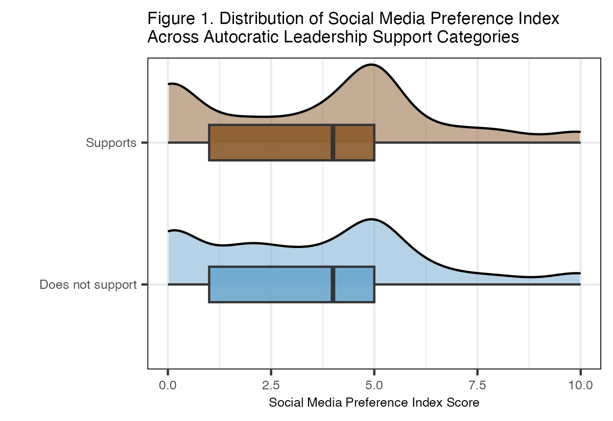
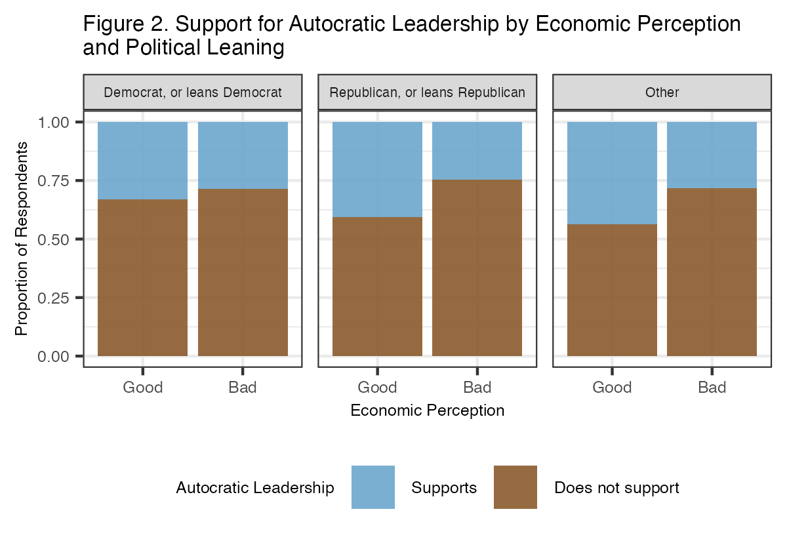

##### Sam Minard^1^ & Efrain Ramirez^2^

^*1*^*Department of Social Sciences & Global Studies, California State University, Monterey Bay, Seaside, CA*  
^*2*^*Department of Psychology, California State University, Monterey Bay, Seaside, CA*

```{r}
#| label: setup
#| include: FALSE
library(haven)
library(readxl) 
library(tidyverse)
library(ggplot2)
library(forcats)
library(sjmisc)
library(ggridges)
library(flextable)
library(boot)
library(pROC)

amertrends_clean <- read_csv("data/data-clean/amertrends_clean.csv")
```


# Abstract

This study uses multiple logistic regression to analyze data from Pew Research Center’s American Trends Panel (ATP Wave 124), investigating how perceived macroeconomic conditions and social media use preferences relate to support for autocratic leadership in the United States. While existing literature suggests that economic anxiety and reliance on social media can foster autocratic sentiments, our results indicate that perceiving the economy as "good" is associated with higher odds of supporting autocracy, contrary to our expectations. The frequency of social media use and its interaction with political ideology were not found to be statistically significant predictors. However, several demographic factors, including income, race, gender, and party affiliation, emerged as significant predictors of autocratic support, although not always in the expected directions.

# Introduction

As of 2021, 70% of the world’s population (5.4 billion people) live under an autocratic regime (Boese et al., 2022). Autocracies are governments where a single person or small group holds unlimited power (Cambridge University Press & Assessment, n.d.), and they often arise from populist movements. Populism is an exclusionary, anti-elitist, anti-pluralist political ideology based on the idea that the “true people” are under threat from an elite enemy, whether economic, political, racial, or foreign (Berlin et al., 1968). This can fuel support for autocratic leaders who claim only they can protect the public, justifying the consolidation of power without accountability (Al Waroi et al., 2024; Baturo et al., 2024). Donald Trump’s populist rhetoric has targeted racial and gender minorities, immigrants, and various so-called “elites,” galvanizing many Americans. Consequently, since regaining the presidency in 2025, Trump has taken steps to consolidate power, moving the U.S. closer to autocracy, with widespread support. Therefore, this paper investigates factors influencing support for autocratic leadership among Americans.

Populist movements are often fueled by perceived economic insecurity, regardless of actual hardship (Gidron & Hall, 2017). Perception of macro-level economic insecurity, not micro-level, significantly predicts support for autocratic leadership (Watson et al., 2021). Severe real-world threats, like the Covid-19 pandemic, can intensify these effects, driving people toward autocratic leaders who offer a sense of control (Rocatto et al., 2020). With Americans' economic outlook largely negative (Cerda, 2025), understanding the link between economic insecurity and anti-democratic sentiment is crucial. Thus, our first research question is: *How does perceived macro-level economic insecurity relate to support for autocratic leadership?*

As media preferences evolve, the relationship between media type and anti-democratic sentiments becomes more significant. Conservative distrust in mainstream media has led many to seek social media, where they encounter populist rhetoric and misinformation (Hutchens et al., 2025; Mourão, 2017). While social media can help disseminate anti-regime information and mobilize collective action, many autocratic regimes have shifted from suppressing social media to co-opting it, insidiously shaping the discourse to maintain stability (Gunitsky, 2015). As social media becomes the primary news source for many, it's crucial to examine its relationship with support for autocratic governance, particularly across political ideologies. We propose the following research question: *Is a preference for social media news associated with support for autocratic leadership, and how does this vary by political ideology?*

This paper addresses these questions to understand factors influencing support for autocratic leadership among Americans. We hypothesize that perceiving the economy as "bad" increases the odds of supporting autocratic leadership. Additionally, we expect a stronger relationship between social media use and support for autocratic leadership among republicans compared to democrats.


# Methods

## Data Collection

This study conducts secondary analysis of the American Trends Panel Wave 124 data set from Pew Research Center, also known as ATP Wave 124. The survey was administered to a nationally representative, stratified random sample of U.S. adults from March 20 to March 26, 2023. Of the 4,058 panelists sampled, 3,576 responded, resulting in a response rate of 88%. Hispanic men, non-Hispanic Black men, and non-Hispanic Asian were oversampled then weighted to provide more precise estimates.

## Variable Creation

The primary dependent variable in this study is support for autocratic leadership, which was measured through the following question: “Would each of the following political systems be a good or bad way of governing this country? A system in which a strong leader can make decisions without interference from Congress or the courts.” Response options included a range from “Very good” to “Very bad,” and “Refused.” This was re-coded into “Supports” and “Does not support" to ensure a binary response variable.

Independent variables we considered included demographics such as age, race, gender, and family income. In addition, we used economic perception (“How would you describe the current economic situation in the U.S.?”) to measure perceived economic insecurity at the macro level. Categories were collapsed into “Good” and “Bad.” Finally, multiple variables measured respondents’ news source and social media preferences, including how often respondents get news, facts, and opinions about issues or events from social media sites, and whether respondents prefer getting various kinds of information from news outlets, social media, both, or neither. The five variables concerning whether respondents preferred news outlets or social media were re-coded to contain three levels (“2: Prefers social media”; “1: Prefers both”; and “0: Prefers news outlets or neither”). Then, the values for each were summed within each row to assign an index score for social media preference to each respondent. With a range of 0-10, higher scores indicated a stronger preference for obtaining information from social media. For all variables, “Refused” responses were treated as “NA” and dropped. 

## Analytic Methods

Frequency tables were used to summarize the counts and proportions for control variables including income, race, gender, and political party categories. They were also used to summarize the response and some explanatory variables. The social media preference index score distribution for each autocratic support category was illustrated with ridgelines and boxplots. Multiple logistic regression was used to predict support for autocratic leadership. We included the aforementioned theory-driven variables as well as income, race ("White" or "Non-White"), gender, and political leaning in the final model. The final control variables were refined through stepwise selection, which removed only age based on model AIC. 

# Results

## Exploratory Data Analysis

Our final sample consisted of 2065 respondents ranging from 18 years old to over 65, of which 1225 were men (59.35%),  816 were women (39.53%), and 23 identified some other way (1.11%) (see Tables 2 and 3). They were grouped into three income levels: lower, middle, and upper income (see Table 4). The sample was 54.72% white (n = 1130) and 45.28% non-white (n = 935) (see Table 5). We observed that 70.57% perceived the economy as “bad” (n = 1458), while the remaining 29.43% (n = 607) perceived the opposite (see Table 6). Politically, 1152 respondents identified as democrats or leaning democrat (55.79%), while 844 respondents reported to be republicans or leaning republican (40.87%) (see Table 7). Support for autocratic leadership was expressed by 604 respondents (29.25%), while 1461 (70.75%) did not support it (see Table 8). The average social media preference index score for the sample was 3.557, with standard deviation 2.725. The distribution of the scores for each group is presented in the figure below. Figure 1 shows that social media preference index score distributions are similar between those who do and do not support autocratic leadership. However, the supportive group's mean score (3.672) was marginally higher than the non-supportive group's (3.510).

######  

Figure 2 displays the proportions of respondents who support autocratic leadership within each economic perception category, faceted by political leaning. Across all political groups, a higher proportion of those who perceive the economy as "good" express support for autocracy. 

###### 

## Statistical Analysis

Table 1 below summarizes the multiple logistic regression model output for autocratic leadership support. The estimates and p-values will be interpreted in the following section. The log odds model is as follows: $$\ln\left(\frac{p(x)}{1-p(x)}\right) = 0.08683 + 0.04188x_1 + 0.02526x_2 - 0.44460x_3 - 0.21556x_4 - 0.58948x_5 + 0.42943x_6 - 0.07835x_7 - 0.69938x_8 - 1.26926x_9 - 0.06374x_{7}x_{1} + 0.05098x_{10}x_{1}$$


# Discussion & Conclusion

The purpose of this study is to determine whether individuals' social media reliance and perception of the economy as generally good or bad might predict support for autocratic leadership in the United States. In addition, an interaction between social media reliance and political ideology was considered. There is very strong evidence that at least one variable in the model with social media preference index score, social media use frequency, economic perception, gender, race, political leaning, income, and the social media preference-political leaning interaction has predictive power of autocratic support (G = 141.0818, p-value < 0.001). However, the model overall is a poor fit, as evidenced by the relatively low Area Under Curve (AUC) value (AUC = 0.6588).

While the model overall is not very effective at predicting autocratic support, several predictors were statistically significant, including perceiving the economy as bad (z = -4.001, p-value < 0.00001), being a man (z = -2.053, p-value = 0.0401), being white (z = -5.482, p-value < 0.00001), being or leaning Republican (z = 2.370, p-value = 0.0178), being middle income (z = -6.333, p-value < 0.00001), and being upper income (z = -8.010, p-value < 0.00001). The intercept, social media preference index score, social media use frequency, being non-binary, identifying with a political party besides Republican or Democrat, and the interaction between social media preference index score and political leaning were not statistically significant.

Based on the model, we can predict the following. When all other variables are held constant, the odds of autocratic support when perceiving the economy as bad are 0.6412 times the odds of support when perceiving the economy as good, which contradicts our expectations and constitutes a 35.95% decrease. The odds of autocratic support among men are 0.8065 times the odds for women and people of other genders, an almost 20% decrease. White individuals’ odds of autocratic support are 0.5557 times that of non-white individuals, indicating that whites’ odds of support are 44.43% lower, again contradicting our expectations. Unsurprisingly, being or leaning republican multiples the odds of autocratic support by 1.5378 compared to being or leaning democrat, a 53.78% increase in the odds. Finally, middle and upper income individuals' odds of autocratic support are respectively 0.4964 and 0.2812 times those of lower income individuals– a 50.36% and 71.88% decrease in the odds– indicating that being lower income increases the probability of autocratic support, when all other variables are held constant.

We hypothesized that perceiving the economy as "bad" has predictive power of support for autocratic leadership, increasing the odds of support. While economic perception was statistically significant, the odds of autocratic support were actually lower when perceiving the economy as bad compared to good, so our hypothesis was not supported. Second, we hypothesized that there is a significant interaction between political party and social media preference index score on the odds of the autocratic support; specifically, the increase in social media preference score was hypothesized to be associated with a greater increase in the odds of the outcome for Republicans than for other political parties. This hypothesis was not supported by sufficient evidence (z = -1.668, p-value = 0.0954).

The results largely disagree with past research and our hypotheses, except in several demographic areas. These contradictions include our findings that macro-level economic insecurity is associated with lower odds of autocratic support, and that there is no statistically significant relationship between having a preference for getting news and information primarily from social media and expressing autocratic support, nor is political ideology a significant mediating factor in the relationship. The frequency of social media use for news consumption is also not associated with significantly increased odds of autocratic support. Interestingly, men and whites are less likely to express autocratic support, contradicting the scholarly consensus that autocratic support tends to be highest among these groups. However, in agreement with previous research, autocratic support is more likely among Republicans and lower income individuals than other political and income groups. 

The inconsistency between our results and existing research may stem from several limitations of this study, and indicates a need for further research on this topic. First, certain explanatory variables related to social media behavior contained a high percentage of missing values which could have influenced the analysis. Second, the data was collected via a stratified sample with oversampling in underrepresented groups, then weighted. However, our analysis did not take weights into account, meaning some racial groups had a disproportionate influence over the analysis. These limitations prevent us from making confident inferences about the factors influencing autocratic support among Americans. However, the results provoke new questions and challenge existing assumptions about the nature of this critical and evolving issue.


\newpage

# References

Al Waroi, M. N. A. L., Riyanta, S., & Rustam, M. R. (2024). Populism and the erosion of democratic checks and balances: A systematic literature review across regions. *International Journal of Multidisciplinary Research and Analysis, 7*(10), 4728-4738. <https://doi.org/10.47191/ijmra/v7-i10-18>

Baturo, A., Kenny, P. D., & Balta, E. (2024). Leaders’ experience and the transition from populism to dictatorship. *Democratization, 1*–24. <https://doi.org/10.1080/13510347.2024.2391482>

Berlin, I., Hofstadter, R., MacRae, D., Schapiro, L., Seton-Watson, H., Touraine, A., Venturi, F., Walicki, A., & Worsley, P. (1968). To define populism. *Government and Opposition, 3*(2), 137–179. <http://www.jstor.org/stable/44481863>

Boese, V. A., Lundstedt, M., Morrison, K., Sato, Y., & Lindberg, S. I. (2022). State of the world 2021: Autocratization changing its nature? *Democratization, 29*(6), 983–1013. <https://doi.org/10.1080/13510347.2022.2069751>

Cambridge University Press & Assessment. (n.d.). Autocracy. In *Cambridge dictionary*. Retrieved March 16, 2025, from <https://dictionary.cambridge.org/us/dictionary/english/autocracy>

Cerda, A. (2025, February 11). *Republicans think economy will improve over the next year, Democrats expect it to get worse.* Pew Research Center. <https://www.pewresearch.org/short-reads/2025/02/11/republicans-think-economy-will-improve-over-the-next-year-democrats-expect-it-to-get-worse/>

Gidron, N., & Hall, P. A. (2017). The politics of social status: Economic and cultural roots of the populist right. *The British Journal of Sociology, 68*(S1). <https://doi.org/10.1111/1468-4446.12319>

Hutchens, M. J., Shaughnessy, B., & DuBosar, E. (2025). Populist hyperpartisans?: The interaction between partisan media exposure and populism in the 2020 US presidential election. *Mass Communication and Society, 28*(1), 51–75. <https://doi.org/10.1080/15205436.2023.2264265>

Mourão, R. R., Thorson, E., Chen, W., & Tham, S. M. (2018). Media repertoires and news trust during the early Trump administration. *Journalism Studies, 19*(13), 1945–1956. <https://doi.org/10.1080/1461670X.2018.1500492>

Pew Research Center. (2023). *American Trends Panel Wave 124* [Data file and codebook]. Retrieved from <https://www.pewresearch.org/dataset/american-trends-panel-wave-124/.> 

Watson, B., Law, S., & Osberg, L. (2022). Are populists insecure about themselves or about their country? Political attitudes and economic perceptions. *Social Indicators Research, 159*(2), 667–705. <https://doi.org/10.1007/s11205-021-02767-8>

\newpage

# Appendix

#### Frequency tables

*Note: For the codes used to create these tables, see the "Creating Frequency Tables" section near the end of this document.*

```{r}
#| label: freq-table-creation
#| echo: false

#must include creation code here, before trying to print the table objects, otherwise it won't knit properly
#setting echo to false so this won't be visible/get in the way of easily viewing the tables
#will include this code again at the bottom of the appendix for documentation purposes so it can be viewed in the knitted word document


#Table 2. Age
#use table function to generate a frequency table
age_freq <- as.data.frame(table(amertrends_clean$age))

#rename columns to match the format
colnames(age_freq) <- c("Age", "Frequency")

#add the percentage column
age_freq$Percent <- (age_freq$Frequency / sum(age_freq$Frequency)) * 100

#create the flextable
freq_age <- flextable(age_freq) |>
  set_caption("Table 2. Frequency Table for Age Categories") |>
  autofit()


#Table 3. Gender
#use table function to generate a frequency table
gender_freq <- as.data.frame(table(amertrends_clean$gender))

#rename columns to match the format
colnames(gender_freq) <- c("Gender", "Frequency") 

#add the percentage column
gender_freq$Percent <- (gender_freq$Frequency / sum(gender_freq$Frequency)) * 100

#create the flextable
freq_gender <- flextable(gender_freq) |>
  set_caption("Table 3. Frequency Table for Gender Categories") |>
  autofit()


#Table 4. Income
#use table function to generate a frequency table
income_freq <- as.data.frame(table(amertrends_clean$income))

#rename columns to match the format
colnames(income_freq) <- c("Income Category", "Frequency")

#add the percentage column
income_freq$Percent <- (income_freq$Frequency / sum(income_freq$Frequency)) * 100

#create the flextable
freq_income <- flextable(income_freq) |>
  set_caption("Table 4. Frequency Table for Income Categories") |>
  autofit()

#Table 5. Race
#use table function to generate a frequency table
race_freq <- as.data.frame(table(amertrends_clean$race_1))

#rename columns to match the format
colnames(race_freq) <- c("Race", "Frequency") 

#add the percentage column
race_freq$Percent <- (race_freq$Frequency / sum(race_freq$Frequency)) * 100

#create the flextable
freq_race <- flextable(race_freq) |>
  set_caption("Table 5. Frequency Table for Race Categories") |>
  autofit()


#Table 6. Economic Perception
#use table function to generate a frequency table
econ_percep_freq <- as.data.frame(table(amertrends_clean$econ_percep))

#rename columns to match the format
colnames(econ_percep_freq) <- c("Economic Perception", "Frequency") 

#add the percentage column
econ_percep_freq$Percent <- (econ_percep_freq$Frequency / sum(econ_percep_freq$Frequency)) * 100

#create the flextable
freq_econ_percep <- flextable(econ_percep_freq) |>
  set_caption("Table 6. Frequency Table for Economic Perception Categories") |>
  autofit()


#Table 7. Political Leaning
#use table function to generate a frequency table
pol_lean_freq <- as.data.frame(table(amertrends_clean$pol_lean))

#rename columns to match the format
colnames(pol_lean_freq) <- c("Political Leaning", "Frequency") 

#add the percentage column
pol_lean_freq$Percent <- (pol_lean_freq$Frequency / sum(pol_lean_freq$Frequency)) * 100

#create the flextable
freq_pol_lean <- flextable(pol_lean_freq) |>
  set_caption("Table 7. Frequency Table for Political Leaning Categories") |>
  autofit()


#Table 8. Autoc Support
#use table function to generate a frequency table
autoc_support_freq <- as.data.frame(table(amertrends_clean$autoc_support_cat))

#rename columns to match the format
colnames(autoc_support_freq) <- c("Autocratic Leadership Support", "Frequency") 

#add the percentage column
autoc_support_freq$Percent <- (autoc_support_freq$Frequency / sum(autoc_support_freq$Frequency)) * 100

#create the flextable
freq_autoc_support <- flextable(autoc_support_freq) |>
  set_caption("Table 8. Frequency Table for Autocratic Leadership Support Categories") |>
  autofit()
```

```{r}
#| label: freq-age
#| echo: false
freq_age
```

# 

```{r}
#| label: freq-gender
#| echo: false
freq_gender
```

# 

```{r}
#| label: freq-income
#| echo: false
freq_income
```

# 

```{r}
#| label: freq-race
#| echo: false
freq_race
```

# 

```{r}
#| label: freq-econ-percep
#| echo: false
freq_econ_percep
```

# 

```{r}
#| label: freq-pol-lean
#| echo: false
freq_pol_lean
```

# 

```{r}
#| label: freq-autoc-support
#| echo: false
freq_autoc_support
```

# 

#### Loading and Cleaning the Data

In the code chunk below, we read in the data and create a subset containing only the relevant variables. We then clean the names, define NAs, and correct the column types.

```{r}
#| label: load-and-clean-data
#| echo: true
#| results: 'markup'
#read the data file
amertrends <- read_sav("data/data-raw/W124_Mar23/ATP W124.sav")

#load the codebook for the data to understand what each variable represents
amertrends_codebook <- read_excel("data/data-raw/W124_Mar23/ATP W124 Codebook.xlsx")

#selecting a subset the variables for exploration 
amertrends_subset <- amertrends |> 
  select(POLSYS_AUTOC_W124, ECON_SIT_W124, NEWSSOURCE_e_W124, NEWSUSE_PLAT_a_W124, NEWSUSE_PLAT_b_W124, NEWSUSE_PLAT_c_W124, NEWSUSE_PLAT_d_W124, NEWSUSE_PLAT_e_W124, F_AGECAT, F_GENDER, F_EDUCCAT, F_RACECMB, F_PARTYSUM_FINAL, F_INC_TIER2)

#change variable names to snake_case
amertrends_subset <- janitor::clean_names(amertrends_subset) 

#converting 99 to NA (99 means "refused"/didn't answer that question so it must be treated as NA)
amertrends_subset <- amertrends_subset |> 
  mutate(across(everything(), ~ replace(.x, .x == 99, NA)))

#redefine column types to factor since they represent ordered categories/likert scale 
amertrends_subset <- amertrends_subset |> 
  mutate(across(where(is.numeric), as.factor))
```

#### Cleaning Response Variable

In the code chunk below, we create two versions of the binary response variable (autoc_support): one with values 0 and 1 for the model, and one with descriptive labels for visualizations.

```{r}
#| label: clean-response
#| results: 'markup'
#make the response autoc variable binary/logical so it will work in the logistic model
#change column type to numeric
amertrends_subset <- amertrends_subset |> 
  mutate(autoc_support = fct_collapse(polsys_autoc_w124,
                                    `1` = c("1", "2"),
                                    `0` = c("3", "4"))) |> 
  drop_na(autoc_support)

#make another version with descriptive labels for frequency table
amertrends_subset <- amertrends_subset |> 
  mutate(autoc_support_cat = fct_collapse(polsys_autoc_w124,
                                    `Supports` = c("1", "2"),
                                    `Does not support` = c("3", "4")))  |> 
  drop_na(autoc_support_cat)
```

#### Cleaning Explanatory Variables

In the code chunk below, we recode the explanatory variables and create a new CSV file containing the clean data. Gender is collapsed into Men and Women/Other, because we want the model to show differences between men vs everyone else all together, not specific differences between men vs non-binary people, men vs women, and women vs non-binary people. The only relevant comparison we need is men vs everyone else. 

```{r}
#| label: clean-explanatory
#| echo: true
#| results: 'markup'

#defining the levels of key explanatory variables

#step 1: economic perception
amertrends_subset <- amertrends_subset|> 
  drop_na(econ_sit_w124) |> 
  mutate(econ_sit_w124 = fct_recode(econ_sit_w124,
                          "very good" = "1",
                          "somewhat good" = "2",
                          "somewhat bad" = "3",
                          "very bad" = "4")) 

#since there are considerably fewer observations at the extremes, collapse econ_sit_w124 into 2 categories: good and bad
amertrends_subset <- amertrends_subset |> 
  mutate(econ_percep = fct_collapse(econ_sit_w124,
                                      Good = c("very good", "somewhat good"),
                                      Bad = c("very bad", "somewhat bad")))

#step 2: creating social media reliance index variable

#re-coding newsuse variables
#newsuse_plat_a basic facts
amertrends_subset <- amertrends_subset |> 
  drop_na(newsuse_plat_a_w124) |> 
  mutate(sm_pref_basicfacts = fct_collapse(newsuse_plat_a_w124,
                                      `2` = c("2"),
                                      `1` = c("3"),
                                      `0` = c("1", "4"))) 
#newsuse_plat_b opinions
amertrends_subset <- amertrends_subset |> 
  drop_na(newsuse_plat_b_w124) |> 
  mutate(sm_pref_opinions = fct_collapse(newsuse_plat_b_w124,
                                      `2` = c("2"),
                                      `1` = c("3"),
                                      `0` = c("1", "4"))) 
#newsuse_plat_c in depth info
amertrends_subset <- amertrends_subset |> 
  drop_na(newsuse_plat_c_w124) |> 
  mutate(sm_pref_indepth = fct_collapse(newsuse_plat_c_w124,
                                      `2` = c("2"),
                                      `1` = c("3"),
                                      `0` = c("1", "4"))) 
#news_plat_d up to date info
amertrends_subset <- amertrends_subset |> 
  drop_na(newsuse_plat_d_w124) |> 
  mutate(sm_pref_uptodate = fct_collapse(newsuse_plat_d_w124,
                                      `2` = c("2"),
                                      `1` = c("3"),
                                      `0` = c("1", "4"))) 
#news_plat_e info that impacts the respondent
amertrends_subset <- amertrends_subset |> 
  drop_na(newsuse_plat_e_w124) |> 
  mutate(sm_pref_impactsr = fct_collapse(newsuse_plat_e_w124,
                                      `2` = c("2"),
                                      `1` = c("3"),
                                      `0` = c("1", "4"))) 

#create the index variable for social media preference
amertrends_subset <- amertrends_subset |> 
  drop_na(sm_pref_basicfacts, sm_pref_opinions, sm_pref_indepth, sm_pref_uptodate, sm_pref_impactsr) |> 
  rowwise() |> 
  mutate(sm_pref_index = sum(as.numeric(as.character(c_across(starts_with("sm_pref_")))))) |>
  ungroup() 

#step 3: social media use frequency

#re-level newssource_plat_e: how frequently they get their news from social media
#make numeric for regression purposes (treat as a score: higher = more frequently)
amertrends_subset <- amertrends_subset |> 
  mutate(sm_freq = fct_recode(newssource_e_w124, 
                              "5" = "1",
                              "4" = "2",
                              "3" = "3",
                              "2" = "4",
                              "1" = "5")) 
#another version with descriptive labels for freq table
amertrends_subset <- amertrends_subset |> 
  mutate(sm_freq_cat = fct_recode(newssource_e_w124, 
                                  "Extremely often" = "5",
                                  "Fairly often" = "4",
                                  "Sometimes" = "3",
                                  "Rarely" = "2",
                                  "Never" = "1")) 

#step 4: demographics 
#re-code age to more descriptive values
amertrends_subset <- amertrends_subset |> 
  mutate(age = fct_recode(f_agecat,
                          "18-29" = "1",
                          "30-49" = "2",
                          "50-64" = "3",
                          "65+" = "4")) 

#recode race to binary, set reference level to non-white
amertrends_subset <- amertrends_subset |> 
  mutate(race_1 = fct_collapse(f_racecmb,
                          "Non-White" =  c("2", "3", "4", "5"),
                          "White" = "1")) |> 
  mutate(race_1 = fct_relevel(race_1,
                             "White", after = 1)) 

#recode party lean, set reference level to democrat
amertrends_subset <- amertrends_subset |> 
  mutate(pol_lean = fct_recode(f_partysum_final,
                          "Republican, or leans Republican" = "1",
                          "Democrat, or leans Democrat" = "2",
                          "Other" = "9"),
         pol_lean = fct_relevel(pol_lean, 
                                "Republican, or leans Republican", after = 1))

#recode income
amertrends_subset <- amertrends_subset |> 
  mutate(income = fct_recode(f_inc_tier2,
                          "Lower income" = "1",
                          "Middle income" = "2",
                          "Upper income" = "3"))

#drop NAs to ensure later codes work (especially ROC curve codes)
amertrends_subset <- amertrends_subset |> 
  drop_na(autoc_support, sm_pref_index, sm_freq, econ_percep, age, race_1, pol_lean, income)

#recode gender, leaving all three original categories (use this version for frequency tables) 
amertrends_subset <- amertrends_subset |> 
  mutate(gender = fct_recode(f_gender,
                             "Man" = "1",
                             "Woman" = "2",
                             "Other" = "3"))

#create gender2 by combining female/other since men are most relevant to our theory
amertrends_subset <- amertrends_subset |> 
  mutate(gender2 = fct_collapse(f_gender,
                                "Woman/Other" = c("2", "3"),
                                "Man" = "1")) 

#write the new CSV and read it in
write_csv(amertrends_subset, "data/data-clean/amertrends_clean.csv")
amertrends_clean <- read_csv("data/data-clean/amertrends_clean.csv", 
                             col_types = cols(
                               sm_pref_index = col_double(),
                               sm_freq = col_double(),
                               autoc_support = col_logical(),
                               .default = col_factor()))

#now all the releveling is messed up, so we need to do it again to ensure the correct reference levels are in the model

#set female/other to reference level for gender2
amertrends_clean <- amertrends_clean |> 
  mutate(gender2 = fct_relevel(gender2, "Woman/Other"))
#check that the levels are right
levels(amertrends_clean$gender2)

#set good to reference level for econ_percep
amertrends_clean <- amertrends_clean |> 
  mutate(econ_percep = fct_relevel(econ_percep, "Good"))
#check that the levels are right
levels(amertrends_clean$econ_percep)

#set democrat to ref level for pol_lean
amertrends_clean <- amertrends_clean |> 
  mutate(pol_lean = fct_relevel(pol_lean, "Democrat, or leans Democrat"))
#check that the levels are right
levels(amertrends_clean$pol_lean)

#set low income to ref level for income
amertrends_clean <- amertrends_clean |> 
  mutate(income = fct_relevel(income, "Lower income"))
#check that the levels are right
levels(amertrends_clean$income)

#set non-white to reference level for race
amertrends_clean <- amertrends_clean |> 
  mutate(race_1 = fct_relevel(race_1, "Non-White"))
#check that the levels are right
levels(amertrends_clean$race_1)

```

#### Figures

In the code chunk below, we create Figures 1 and 2.

```{r}
#| label: figures
#| echo: true
#| results: 'markup'

#boxplot + ridgelines for sm_pref_index by autoc_support categories
amertrends_clean |> 
  ggplot(aes(x = sm_pref_index, 
             y = autoc_support_cat, 
             fill = autoc_support_cat)) +
   geom_density_ridges(scale = 0.55, 
                       alpha = 0.5) +
  geom_boxplot(aes(fill = autoc_support_cat),
               width = 0.25,
               alpha = 0.9) +
  theme_bw() +
  scale_fill_manual(values = c("skyblue3", "tan4")) +
  labs(x = "Social Media Preference Index Score",
       y = "",
       title = "Figure 1. Distribution of Social Media Preference Index \nAcross Autocratic Leadership Support Categories") +
  guides(fill = "none") +
  xlim(0,10) +
  theme(legend.text = element_text(size = 6),
        legend.title = element_text(size = 6),
        axis.text.x = element_text(size = 6),
        axis.title.x = element_text(size = 6),
        axis.text.y = element_text(size = 6),
        plot.title = element_text(size = 8))

#ggsave("Figure_1.png", width = 4, height = 2.75)

#summary stats for each category 
amertrends_clean |> 
  group_by(autoc_support_cat) |> 
  summarize(`mean sm_pref_index` = mean(sm_pref_index),
            sd = sd(sm_pref_index))

amertrends_clean |> 
  ggplot() +
  geom_bar(aes(x = econ_percep,
               fill = autoc_support_cat),
           position = "fill",
           alpha = 0.9) +
  facet_wrap(~pol_lean, ncol = 3) +
  theme_bw() +
  theme(legend.position = "bottom",
        legend.text = element_text(size = 6),
        legend.title = element_text(size = 6),
        axis.text.x = element_text(size = 6),
        axis.title.x = element_text(size = 6),
        axis.title.y = element_text(size = 6),
        axis.text.y = element_text(size = 6),
        plot.title = element_text(size = 8),
        strip.text = element_text(size = 5)) +
  scale_fill_manual(values = c("skyblue3", "tan4")) +
  labs(x = "Economic Perception",
       y = "Proportion of Respondents",
       fill = "Autocratic Leadership",
       title = "Figure 2. Support for Autocratic Leadership by Economic Perception \nand Political Leaning")

#ggsave("Figure_2.png", width = 4, height = 2.75)
```

#### Building Version 1 of the Model

In the code chunk below, we create the first model with all demographic and theory-driven variables under consideration. We then check the ROC curve.

```{r}
#| label: model-v1
#| echo: true
#| resulsts: 'markup'

#creating the first model using all theory-driven variables AND all demographic/control variables
autoc_lm_v1 <- glm(autoc_support ~ sm_pref_index + sm_freq + factor(econ_percep) + factor(age) + factor(gender2) + factor(race_1) + factor(pol_lean)  + factor(pol_lean)*sm_pref_index + factor(income), family = binomial(link = "logit"), data = amertrends_clean)
summary(autoc_lm_v1)

#ROC curve for v1
#predicted probabilities
predicted_probs_v1 <- predict(autoc_lm_v1, type = "response")
#actual outcomes
actual_outcomes_v1 <- autoc_lm_v1$y
#ROC plot and AUC
roc_v1 <- roc(actual_outcomes_v1, predicted_probs_v1)
plot(roc_v1, legacy.axes = TRUE, main = "ROC Curve for autoc_lm_v1", 
     col = "blue", xlab = "False Positive Rate (1 - Specificity)", 
     ylab = "True Positive Rate (Sensitivity)")

auc(roc_v1)

#not a great model, so we will try adjusting which demographic variables are included to see if that improves things
```

#### Building Version 2 of the Model

In the code chunk below, we use stepwise selection to find the "best" model. Because the variable selection is partly theory-driven, we make the smaller model include the theory-driven variables to ensure they are included in the final model, rather than setting the lower model to a null model. The process results in a model that includes every predictor except age. We then check the ROC curve and find that it is not much better or worse than the previous model. Given the stepwise results and the fact that all age categories were insignificant per the Wald-z tests, we decide to proceed with the model without age. 

When checking assumptions, there appears to be collinearity between the interaction term sm_pref_index*pol_lean and pol_lean, but that seems unavoidable. The large sample size assumption is met (n = 2065), as is the independence of outcomes and variables assumption. 

```{r}
#| label: model-v2
#| echo: true
#| results: 'markup' 

#stepwise selection to determine best demographic variables for the model
#fit the lower and upper models
#lower includes the theory-driven variables that must be included in the model regardless of their effect on AIC
small_v1<- glm(autoc_support ~ sm_pref_index + sm_freq + factor(econ_percep) + factor(pol_lean) + factor(pol_lean)*sm_pref_index , family = binomial(link = "logit"), data = amertrends_clean)
#big has optional demographic variables
big_v1<- glm(autoc_support ~ sm_pref_index + sm_freq + factor(econ_percep) + factor(age) + factor(gender2) + factor(race_1) + factor(pol_lean) + factor(pol_lean)*sm_pref_index + factor(income), family = binomial(link = "logit"), data = amertrends_clean)
#stepwise selection based on AIC
autoc_lm_v2 <- step(big_v1, scope = list(lower = small_v1, upper = big_v1), direction = "both")
#final selected model (based on AIC) includes race, political leaning, and income as controls (age was removed)

#model parameter estimates and significance testing
summary(autoc_lm_v2)

#ROC curve for v2
#predicted probabilities
predicted_probs_v2 <- predict(autoc_lm_v2, type = "response")
#actual outcomes
actual_outcomes_v2 <- autoc_lm_v2$y
#ROC
roc_v2 <- roc(actual_outcomes_v2, predicted_probs_v2)
#plot the curve
plot(roc_v2, legacy.axes = TRUE, main = "ROC Curve for autoc_lm_v2", 
     col = "blue", xlab = "False Positive Rate (1 - Specificity)", 
     ylab = "True Positive Rate (Sensitivity)")
auc(roc_v2)
#AUC gets slighter smaller but the difference is negligible
#decided to proceed with model v2 (sans age) because it isn't a significant predictor anyway and does not add much value to the model

#assumptions: check for collinearity
#some collinearity between the interaction sm_pref_index*pol_lean and pol_lean, but the rest are fine
car::vif(autoc_lm_v2)

#check significance overall
G <- autoc_lm_v2$null.deviance - autoc_lm_v2$deviance
G
df <- autoc_lm_v2$df.null - autoc_lm_v2$df.residual
1 - pchisq(G, df)
```

#### Cross-Validation

The cross-validation prediction error or average test MSE when using 10-fold cross validation is 0.2010 for model v2 (our final model). Model v1 (which contained age before stepwise selection recommended removing it) had an average test MSE of 0.2105. Therefore, we will continue with model v2 as our final model, considering it has performed better during cross-validation, AUC comparisons, and AIC comparisons. 

```{r}
#| label: cross-validation
#| echo: true
#| results: 'asis'
#| warning: false
# 10-fold cross validation

#set seed for reproducibility
set.seed(410)

#final model v2: calculate cross-validation prediction error using only complete cases (4 NAs within 2 rows dropped)
cv.err1.2 <- cv.glm(data = amertrends_clean[complete.cases(amertrends_clean), ], 
                  glmfit = autoc_lm_v2, 
                  K = 10)

#output average test MSE, AKA cross-validation prediction error
cv.err1.2$delta[1]

#compare to model v1
cv.err1.1 <- cv.glm(data = amertrends_clean[complete.cases(amertrends_clean), ], 
                  glmfit = autoc_lm_v1, 
                  K = 10)
cv.err1.1$delta[1]

```


#### Creating Model Version 2 Summary Table

In the code chunk below, we create the summary table for the final mode. 

```{r}
#| label: model-summary-table
#| echo: true
#| results: 'markup'

#define the coefficients in a vector
coef <- c(0.08683, 0.04188, 0.02526, -0.44460, -0.21556, -0.58948, 0.42943, -0.07835, -0.69938, -1.26926, -0.06374, 0.05098)
#define the std. errors
std.error <- c(0.29769, 0.02622, 0.07019, 0.11113, 0.10501, 0.10753, 0.18119, 0.44964, 0.11043, 0.15847, 0.03822, 0.10175)
#define z scores
z.value <- c(0.292, 1.597, 0.360, -4.001, -2.053, -5.482, 2.370, -0.174, -6.333, -8.010, -1.668, 0.501)
#define p-values
p.value <- c("0.7705", "0.1102", "0.7189", "<0.0001***", "0.0401*", "<0.00001***", "0.0178*", "0.8617", "<0.00001***", "<0.00001***", "0.0954", "0.6163")
#odds ratios
odds.ratios <- round(exp(coef), 4)

#put them into a data frame
summary_v2 <- data.frame(
  Estimate = coef,
  `Std. Error` = std.error,
  `z-value` = z.value,
  `p-value` = p.value)
#give the rows descriptive names 
rownames(summary_v2) <- c("Intercept", "Social Media Pref. Index", "Social Media Use Frequency", "Economic Perception (Bad)", "Man", "White", "Republican, or Leans Republican", "Other Political Party", "Middle Income", "Upper Income", "Social Media Pref. Index * Republican, or Leans Republican","Social Media Pref. Index * Other Political Party")

#add row names as a column
summary_v2$Variable <- rownames(summary_v2)

#reorder to put 'variable' first
summary_v2 <- summary_v2[, c("Variable", setdiff(colnames(summary_v2), "Variable"))]

#make the flextable
model_summary_table <- flextable(summary_v2) |> 
  set_caption("Table 1. Output for Multiple Logistic Regression Model") |> 
  set_header_labels(
    Variable = "Variable",
    Estimate = "Estimate",
    `Std. Error` = "Std. Error",
    `z-value` = "z-value",
    `p-value` = "p-value") |> 
  autofit()

model_summary_table
```

#### Creating Frequency Tables

####### 2. Age
```{r}
#| label: freq-age-creation
#| echo: true
#| results: 'markup'

#use table function to generate a frequency table
age_freq <- as.data.frame(table(amertrends_clean$age))

#rename columns to match the format
colnames(age_freq) <- c("Age", "Frequency")

#add the percentage column
age_freq$Percent <- (age_freq$Frequency / sum(age_freq$Frequency)) * 100

#create the flextable
freq_age <- flextable(age_freq) |>
  set_caption("Table 2. Frequency Table for Age Categories") |>
  autofit()

freq_age
```

####### 3. Gender
```{r}
#| label: freq-gender-creation
#| echo: true
#| results: 'markup'

#use table function to generate a frequency table
gender_freq <- as.data.frame(table(amertrends_clean$gender))

#rename columns to match the format
colnames(gender_freq) <- c("Gender", "Frequency") 

#add the percentage column
gender_freq$Percent <- (gender_freq$Frequency / sum(gender_freq$Frequency)) * 100

#create the flextable
freq_gender <- flextable(gender_freq) |>
  set_caption("Table 3. Frequency Table for Gender Categories") |>
  autofit()

freq_gender
```

####### 4. Income
```{r}
#| label: freq-income-creation
#| echo: true
#| results: 'markup'

#use table function to generate a frequency table
income_freq <- as.data.frame(table(amertrends_clean$income))

#rename columns to match the format
colnames(income_freq) <- c("Income Category", "Frequency")

#add the percentage column
income_freq$Percent <- (income_freq$Frequency / sum(income_freq$Frequency)) * 100

#create the flextable
freq_income <- flextable(income_freq) |>
  set_caption("Table 4. Frequency Table for Income Categories") |>
  autofit()

freq_income
```

####### 5. Race
```{r}
#| label: freq-race-creation
#| echo: true
#| results: 'markup'

#use table function to generate a frequency table
race_freq <- as.data.frame(table(amertrends_clean$race_1))

#rename columns to match the format
colnames(race_freq) <- c("Race", "Frequency") 

#add the percentage column
race_freq$Percent <- (race_freq$Frequency / sum(race_freq$Frequency)) * 100

#create the flextable
freq_race <- flextable(race_freq) |>
  set_caption("Table 5. Frequency Table for Race Categories") |>
  autofit()

freq_race
```

####### 6. Economic Perception
```{r}
#| label: freq-econ-percep-creation
#| echo: true
#| results: 'markup'

#use table function to generate a frequency table
econ_percep_freq <- as.data.frame(table(amertrends_clean$econ_percep))

#rename columns to match the format
colnames(econ_percep_freq) <- c("Economic Perception", "Frequency") 

#add the percentage column
econ_percep_freq$Percent <- (econ_percep_freq$Frequency / sum(econ_percep_freq$Frequency)) * 100

#create the flextable
freq_econ_percep <- flextable(econ_percep_freq) |>
  set_caption("Table 6. Frequency Table for Economic Perception Categories") |>
  autofit()

freq_econ_percep
```

####### 7. Political Leaning 
```{r}
#| label: freq-pol-lean-creation
#| echo: true
#| results: 'markup'

#use table function to generate a frequency table
pol_lean_freq <- as.data.frame(table(amertrends_clean$pol_lean))

#rename columns to match the format
colnames(pol_lean_freq) <- c("Political Leaning", "Frequency") 

#add the percentage column
pol_lean_freq$Percent <- (pol_lean_freq$Frequency / sum(pol_lean_freq$Frequency)) * 100

#create the flextable
freq_pol_lean <- flextable(pol_lean_freq) |>
  set_caption("Table 7. Frequency Table for Political Leaning Categories") |>
  autofit()

freq_pol_lean
```

####### 8. Autocratic Support
```{r}
#| label: freq-autoc-support-creation
#| echo: true
#| results: 'markup'

#use table function to generate a frequency table
autoc_support_freq <- as.data.frame(table(amertrends_clean$autoc_support_cat))

#rename columns to match the format
colnames(autoc_support_freq) <- c("Autocratic Leadership Support", "Frequency") 

#add the percentage column
autoc_support_freq$Percent <- (autoc_support_freq$Frequency / sum(autoc_support_freq$Frequency)) * 100

#create the flextable
freq_autoc_support <- flextable(autoc_support_freq) |>
  set_caption("Table 8. Frequency Table for Autocratic Leadership Support Categories") |>
  autofit()

freq_autoc_support
```
